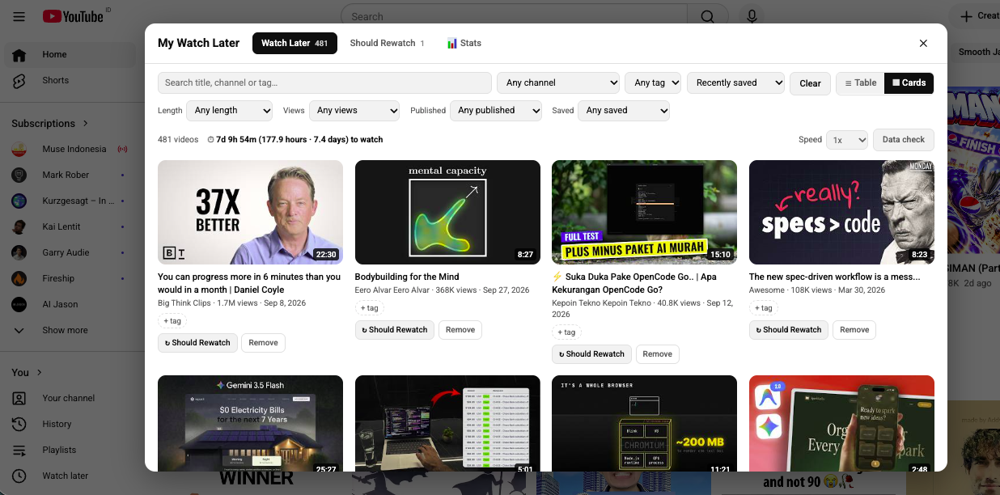
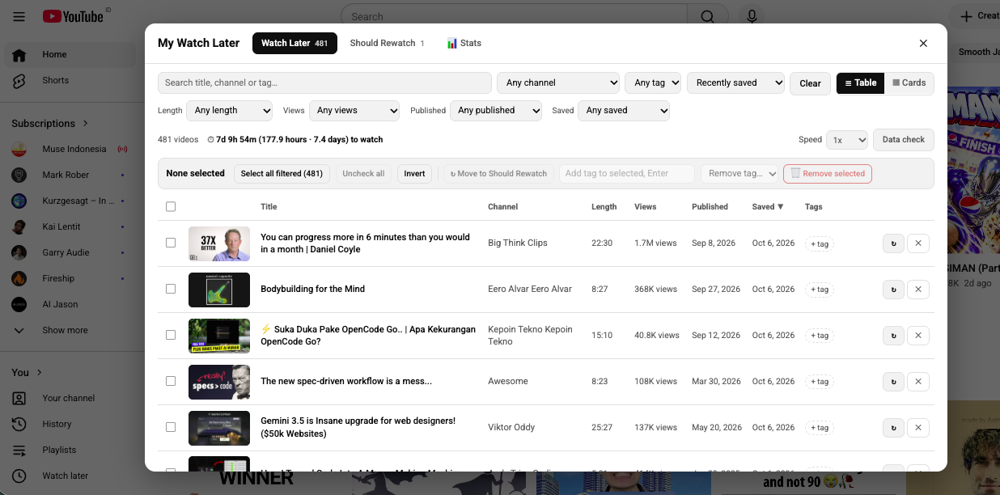
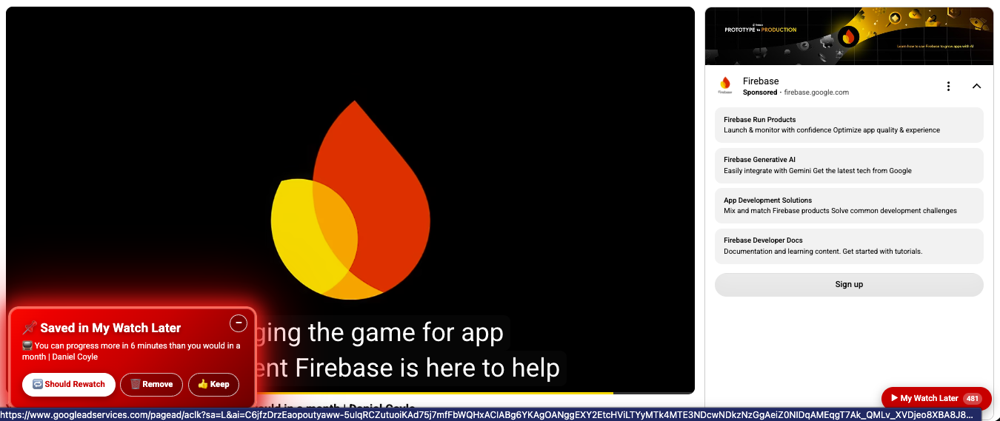

# My Watch Later

**A better Watch Later for YouTube.** Save any video with a right-click, then browse your list in a clean,
filterable dialog instead of YouTube's endless scroll. Know how many hours your list really holds, clear it out
in bulk, and see whether you are actually getting through it.

Everything stays in your browser. No account, no server, no tracking.



## Features

- **Right-click to save.** Right-click any video thumbnail or video page and choose **Add to My Watch Later**.
- **A dialog instead of a long list.** Opens on youtube.com and replaces YouTube's own Watch Later page. Switch
  between **cards** and a **table**.
- **Filters that fit.** Search, channel and tag, plus **Length**, **Views**, **Published** and **Saved**, each with
  presets or a **custom range** you type in (for example 5 to 20 minutes, or 10k to 1.5M views).
- **How long is my list?** A running total of the time to watch whatever you have filtered, such as
  `7d 9h 54m (177.9 hours · 7.4 days)`, with a playback-speed setting.
- **Mass editing.** Tick videos (shift-click for a range, or select everything the filters show), then move,
  tag, untag or remove them all at once. Removals can be undone.
- **Should Rewatch.** A second list for videos worth watching again. A red prompt on any saved video offers
  *Should Rewatch*, *Remove* or *Keep*, and it can shrink to a small pill.
- **Bring your old list in, or clear it out.** Import your existing YouTube Watch Later, and optionally empty
  YouTube's own copy (with a backup and a typed confirmation).
- **Stats.** How many videos you added and finished, how fast, how long until the list would be empty, which
  lengths and channels you actually finish, your oldest unfinished videos, and more.
- **Tags, backup and dark mode.** Export and import your list and history as a file. The dialog follows YouTube's
  dark theme and hides itself in fullscreen.

> **Want to make your own version?** [FEATURES.md](FEATURES.md) lists every feature, the rules each one follows, the
> data it stores and a suggested build order. Use it as a checklist, and pick only the parts you want.

### Table view and bulk actions



### The Should Rewatch / Remove prompt



## Install

The extension is installed from source (there is no build step).

1. Download or clone this repository.
2. Open `chrome://extensions` in Chrome (or Brave, Edge, Arc, or any Chromium browser, version 105 or newer).
3. Turn on **Developer mode** (top right).
4. Click **Load unpacked** and choose the project folder (the one containing `manifest.json`).
5. **Refresh any YouTube tab that was already open.**

After you change any file, press the reload icon on the extension's card, then refresh YouTube.

## Using it

### Save and browse

| I want to… | Do this |
| --- | --- |
| Save a video | Right-click a thumbnail (or a video page) → **Add to My Watch Later** |
| Tag it right away | Type in the small box in the "Saved" notice and press Enter |
| Open my list | Go to youtube.com, or click the red **▶ My Watch Later** button, or the toolbar icon |
| Switch view | **☰ Table / ▦ Cards** next to the filters (your choice is remembered) |
| Filter | Use the dropdowns and search box. **Clear** resets everything |
| Filter by an exact value | Pick **Custom range…** under Length, Views, Published or Saved, then type a from and a to. Leave one side empty for "at least" or "at most" |
| Sort | Use the sort dropdown, or click a column title in the table |
| See the total time | Read the **⏱** line under the filters. It follows your filters, and **Speed** changes it |

### Edit in bulk (table view)

Tick the box on the left of a row, or click anywhere on the row. **Shift-click** ticks everything between two rows.
The box in the header ticks everything the filters show. The bar above the table then offers:

- **Select all filtered**, **Uncheck all** and **Invert**
- **Move** the ticked videos to the other list
- **Add a tag** to all of them (type it, press Enter), or **remove a tag** from them
- **🗑 Remove selected**, which asks first and then gives you 20 seconds to undo

Ticked rows are always rows you can see. If you change a filter or switch tabs, rows that disappear are
unticked, so a bulk action can never touch a video you cannot see.

### Rewatch

Click **↻ Should Rewatch** on a video to move it to the second tab, and **↩ Back to Watch Later** to undo it.

Whenever you open a video that is in your Watch Later list, a red prompt appears with **Should Rewatch**,
**Remove** and **Keep**. It stays until you choose, and it comes back as "Finished this one?" when the video ends.
The **–** button shrinks it to a small pill; click the pill to open it again. You can turn the prompt off in Settings.

### Import and clean up YouTube's own list

Open `youtube.com/playlist?list=WL` while signed in. Two buttons appear in the dialog:

- **Import from YouTube Watch Later** copies your existing list into the extension. Published dates are estimated from
  YouTube's "2 years ago" text (shown as `~Mar 2023`). Click **Fill missing details** to read the exact dates.
- **Remove all from YouTube Watch Later…** empties YouTube's own list by clicking its "Remove from Watch later" menu
  item for each video. It is hard to undo, so it asks you to keep **Copy all videos into My Watch Later first** ticked
  (the copy is checked before anything is removed) and to type `REMOVE`. **Stop** works at any time. It needs YouTube
  set to English.

### Stats

Open the dialog and choose **📊 Stats**. Pick a range (7 days up to all time) to see:

- tiles for **added**, **finished**, **finish rate**, **thrown away**, **waiting now** and **streak**
- an **Added vs finished** chart and a **List size over time** chart (each has a "View as table")
- **Insights** in plain words: your pace and how long until the list would be empty, hours added versus hours
  finished, how long videos wait, old videos you never finished, which lengths and channels you finish, your best
  day and hour, and how many finished videos went to Should Rewatch

Imported videos are left out of the charts by default, because importing hundreds of videos in one go would flatten
every chart. Tick **Include imported videos** to count them.

### Settings, backup and history

Click the toolbar icon, then **Settings & backup**. There you can:

- choose whether the dialog replaces YouTube's Watch Later page and opens on the home page
- turn the Should Rewatch / Remove prompt on or off
- **Export** your list and history to a file, and **Import** it back (nothing is duplicated)
- turn history off, or **Clear history**
- delete all saved videos

## Privacy

- **Your data stays on your computer.** The list, tags and history live in the browser's extension storage
  (`chrome.storage.local`). Nothing is sent to any server, and there are no analytics, ads or tracking.
- **What it talks to.** To read a video's length, views and published date, the extension loads that video's normal
  YouTube watch page, the same page your browser loads when you open the video. Thumbnails come from YouTube's image
  servers. It contacts nothing else.
- **Permissions, and why:**

  | Permission | Why |
  | --- | --- |
  | `contextMenus` | The right-click item **Add to My Watch Later** |
  | `storage` | Saving your list, settings and history locally |
  | `https://www.youtube.com/*` | Showing the dialog on YouTube and reading video details from watch pages |

### What the history records

The Stats tab is powered by a small log kept in the same local storage:

| Event | When |
| --- | --- |
| added | you save a video (right-click or import) |
| finished | a saved video reaches its end (the last 5 seconds count) |
| removed | you remove a video, with a reason: *done* (Remove on the prompt right after finishing), *manual*, *bulk* or *clear* |
| moved | a video goes to Should Rewatch or back |
| tagged | you add a tag |
| prompt | which button you pressed on the red prompt |

It also keeps one snapshot a day of how many videos are waiting and how long they are. Undo cancels the removal it
undid, so it never counts. Videos you saved before history existed are added to the log once, dated when you saved
them. Only the latest 20,000 events are kept.

## Troubleshooting

| Problem | Fix |
| --- | --- |
| No button or right-click item on YouTube | Refresh the YouTube tab. The extension only attaches to pages loaded after it was installed or reloaded |
| "Extension context invalidated" in the console | You reloaded the extension while a tab was open. The old copy switches itself off. Refresh the tab |
| Import found nothing | Open `youtube.com/playlist?list=WL` while signed in, then press Import again |
| Length, views or published date missing | Click **Fill missing details**. A video that YouTube won't describe still saves, it just won't match those filters |
| A published filter shows nothing | Videos with an unknown date can't match it. The summary line says how many are hidden. Fill the details, or open **Data check** |
| "Remove all" stops partway | YouTube may have changed its page, or the interface is not in English. The message tells you how many were removed; the rest are untouched |

## Limitations

- YouTube changes its page layout from time to time. The import, the "which video did I right-click" helper and
  **Remove all from YouTube Watch Later** read or click the page, so they may need a small fix someday. Saving
  reads the video's own page and is more stable.
- YouTube does not let extensions read or edit its Watch Later list through an API, so those two features work by
  reading and clicking the page.
- Your list lives in this browser only. There is no sync between devices, so use **Export** to keep a backup.
- Use **Remove all from YouTube Watch Later…** at your own risk. It automates YouTube's own menus on your account.

## Development

No build step and no dependencies: plain JavaScript (ES modules) and the browser's extension APIs.

```
node --test        # runs all unit tests (or: npm test)
```

The tests use Node's built-in runner. They cover the pure logic (filters, history maths, insights, storage with an
in-memory stand-in for `chrome.storage`, and the Stats tab built against a small fake DOM). The pages themselves are
checked by loading the extension in a browser.

| Path | What it does |
| --- | --- |
| `manifest.json` | Extension setup and permissions (Manifest V3) |
| `background.js` | Right-click menu, reads video details, saves, first-run history backfill |
| `content/overlay.js` | The dialog, toasts, red prompt, floating button and routing on youtube.com |
| `content/stats.js` | The Stats tab and its SVG charts |
| `content/native-wl.js` | Reading and clearing YouTube's own Watch Later page |
| `content/dom.js`, `loader.js`, `overlay.css` | DOM helpers, the content-script loader, and the styles |
| `lib/model.js` | Video ids, record shape, tags, import merge |
| `lib/filters.js` | Filtering, sorting, totals and number formatting |
| `lib/metadata.js` | Reads title, channel, length, views and published date from a watch page |
| `lib/events.js` | The history log and all the Stats maths |
| `lib/insights.js` | The plain-language Insights sentences |
| `lib/storage.js` | Everything that touches `chrome.storage.local`, including history logging |
| `popup/`, `options/` | The toolbar popup and the settings page |
| `tests/` | Unit tests |
| `docs/` | Planning notes (checklists) for each feature |
| `FEATURES.md` | The full feature list, data model and build order (a spec for making your own version) |

## Disclaimer

This is an independent project. It is not affiliated with, endorsed by, or sponsored by YouTube or Google.
YouTube is a trademark of Google LLC.
